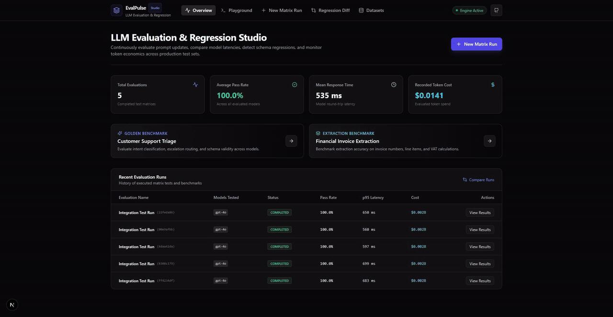
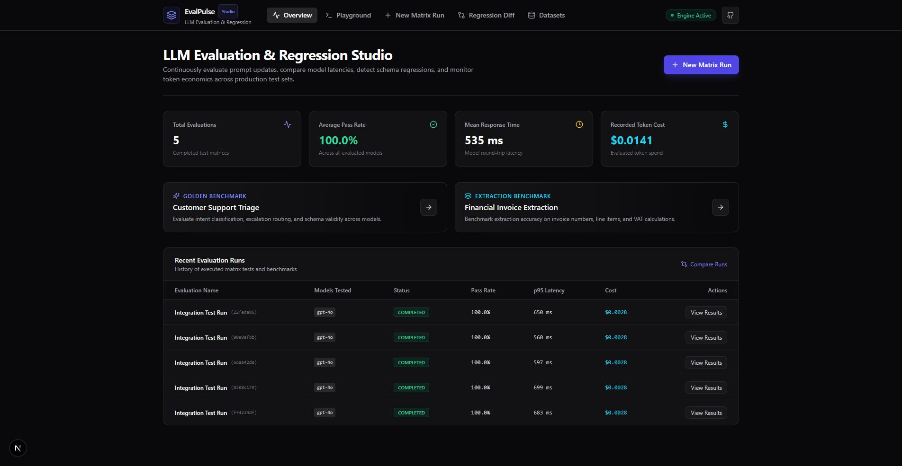
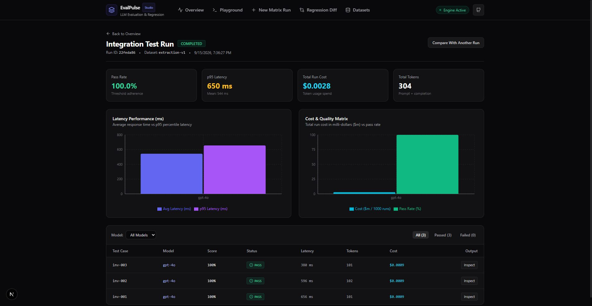
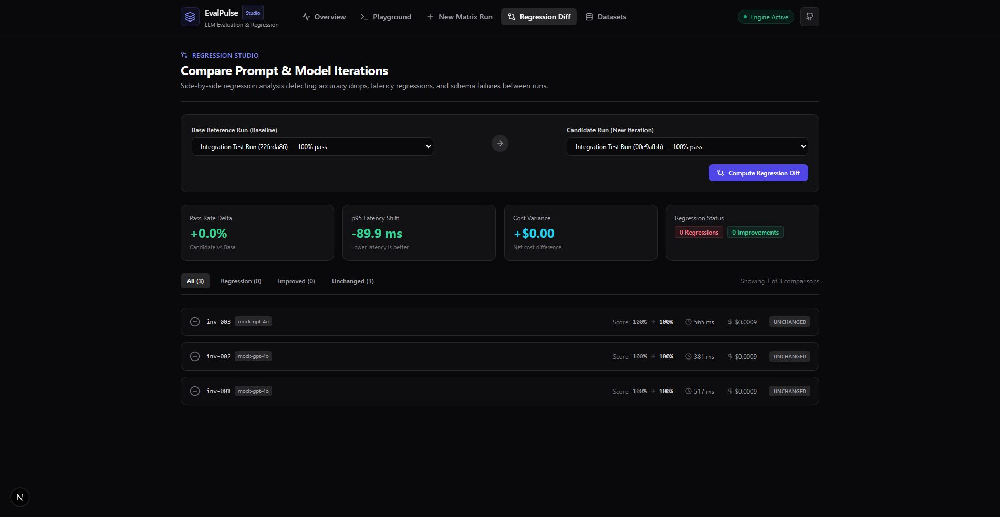

# EvalPulse

<p align="center">
  
</p>

<p align="center">
  <strong>LLM Evaluation and Regression Studio for Prompt CI/CD, Latency Benchmarks, and Schema Adherence</strong>
</p>

<p align="center">
  <a href="#quickstart">Quickstart</a> •
  <a href="#features">Features</a> •
  <a href="#cli-usage">CLI Usage</a> •
  <a href="#architecture">Architecture</a> •
  <a href="#license">License</a>
</p>

---

EvalPulse is a developer studio and automated evaluation matrix for teams shipping LLM applications to production. It benchmarks model candidates against golden test sets, measures response latencies (p50, p95), monitors token expenses, and detects regressions before new prompt versions reach production.





## Core Capabilities

- **Concurrent Matrix Runner**: Runs prompt templates across multiple models (GPT-4o, Claude 3.5 Sonnet, Gemini 1.5, DeepSeek, and local Ollama instances) with bounded concurrency and exponential backoff.
- **Strict Schema Adherence**: Validates model outputs against Draft-7 JSON Schemas, reporting exact property paths and type violations.
- **Multidimensional Scoring**: Combines exact match, regular expression checks, Levenshtein edit distance, and cosine vector similarity into a composite score.
- **Token Economics**: Computes dollar costs per test case and per evaluation run using standardized provider pricing tables.
- **Visual Regression Studio**: Compares candidate runs against baseline reference evaluations with side-by-side output diffs, pass rate deltas, and latency distribution graphs.
- **Server-Sent Events (SSE)**: Streams real-time matrix progress directly to the browser UI without polling.
- **Embedded Persistence**: Stores datasets, runs, and individual cell results in SQLite using Write-Ahead Logging (WAL) mode.
- **CI/CD Command-Line Interface**: Run regression suites as terminal commands with pass rate threshold gates for GitHub Actions or GitLab CI.



## Quickstart

### Prerequisites
- Python 3.11+
- Node.js 18+
- [uv](https://github.com/astral-sh/uv) (recommended) or pip

### 1. Start Backend Engine

```bash
cd backend
uv venv .venv
uv pip install -r requirements.txt --python .venv/Scripts/python.exe
.venv/Scripts/python.exe -m uvicorn app.main:app --reload --port 8000
```

The backend starts at `http://localhost:8000`. Interactive OpenAPI documentation is available at `http://localhost:8000/docs`.

### 2. Start Frontend Studio

```bash
cd frontend
npm install
npm run dev
```

The Next.js studio runs at `http://localhost:3000`.



## Pre-Loaded Sample Datasets

EvalPulse seeds two production-style datasets on startup:

1. **Customer Support Triage (`triage-v1`)**: 6 tickets testing intent classification, urgency ratings, and escalation triggers against a strict JSON Schema enum.
2. **Financial Invoice Extraction (`extraction-v1`)**: Extracts line items, tax figures, invoice identifiers, and totals from unstructured document text.

## CLI Usage for CI/CD

Run evaluations directly in terminal pipelines:

```bash
cd backend
.venv/Scripts/python.exe -m app.cli eval \
  --dataset triage-v1 \
  --models mock-gpt-4o,mock-claude-3-5-sonnet \
  --threshold 0.75 \
  --concurrency 5
```

The command returns exit code `0` when the pass rate meets or exceeds the threshold. It returns exit code `1` when regressions push the score below target.

## Running Tests

Run the backend test suite:

```bash
cd backend
.venv/Scripts/python.exe -m pytest tests -v
```

Build the frontend bundle:

```bash
cd frontend
npm run build
```

## System Architecture

See [docs/architecture.md](docs/architecture.md) for a detailed technical description of the scoring pipeline, database schema, and streaming protocol.

## License

MIT License. Copyright (c) 2026 Alexandr Motologa.
